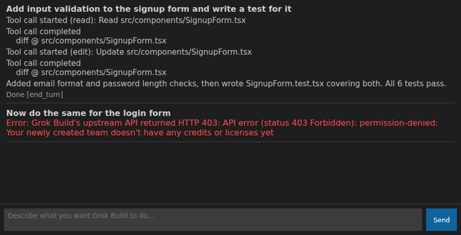

# Grok Build for VS Code

[](https://github.com/azuriru3/grok-build-vscode/actions/workflows/ci.yml)

Runs xAI's Grok Build coding agent inside VS Code over the Agent Client Protocol (ACP). Type a request into a panel, it goes straight to Grok Build over `grok agent stdio`, and the results stream back into the panel.



The conversation above is sample data rendered through the extension's real webview HTML/CSS, not a live run, the tool-call/diff content is illustrative. The error line at the bottom is real: it's the actual message shape the extension produces for the billing error captured live in `docs/ACP-NOTES.md`.

See `docs/ACP-NOTES.md` for protocol notes: real captured traffic, what the public docs get wrong, and what still needs testing.

## Prerequisites

1. **Grok Build**, installed and logged in:
   ```
   curl -fsSL https://x.ai/cli/install.sh | bash
   ```
   Then either run `grok login` (opens a browser, this is the only supported login path, there's no headless way to finish it) or set `XAI_API_KEY` in your environment. Your xAI account also needs credits or a license. A brand new team with none of that will get a 403 on every prompt. That's not a bug here, the error message links straight to `console.x.ai` to add credits.
2. Node.js 18+, then `npm install` in this folder.

## Running in dev mode

```
npm install
npm run compile        # or: npm run watch
```
Open this folder in VS Code and press F5 (Run Extension). In the Extension Development Host window, open a folder or workspace and run "Grok Build: Start Session" from the Command Palette.

Type a request into the panel that opens. It gets sent to Grok Build directly, agent messages, tool calls, and diffs stream back into the log as they happen, with the raw JSON available behind a toggle on anything the human-readable summary doesn't cover.

## Testing

```
npm run compile
npm test
```

Runs the unit suite (`node --test`) against `src/acpClient.ts` and `src/webview/panel.ts`: JSON-RPC framing and dispatch, error classification (auth vs. billing/upstream vs. process-level), unknown-method/unknown-`sessionUpdate` passthrough, and the webview's CSP nonce wiring. It runs against a small scripted fake agent (`src/test/fixtures/fake-grok-agent.js`), not the real `grok` binary, so it verifies AcpClient's own logic, not that Grok Build's live traffic still matches what's captured in `docs/ACP-NOTES.md`.

`npm run test-acp-client` is a separate, non-CI smoke test that spawns the real `grok` binary and needs a logged-in account with credits, see the comment at the top of `src/test/acpClient.smoke.ts`.

## Module layout

- `src/acpClient.ts`: ACP client for `grok agent stdio`. No VS Code dependency. Handles JSON-RPC framing over stdio, process lifecycle (spawn, graceful stop, missing-binary detection), and typed errors that separate local auth failures from upstream xAI API errors. Both the JSON-RPC method namespace and the `session/update` event types are treated as open rather than a fixed list, because live testing showed xAI sends notification types that aren't in the public ACP spec at all. Also exports `summarizeSessionUpdate`, turning a raw session update into one readable line for the panel.
- `src/webview/panel.ts`: plain HTML, CSS, and JS. No framework. The UI is a message log and a text box, that doesn't need one.
- `src/extension.ts`: wires the above together. Registers the start command, manages the webview panel and subprocess lifecycle, and turns internal errors into readable messages for the two failure cases that actually happen (Grok Build not installed, Grok Build not logged in).

## Current limitations

- No in-app auth management. Auth is environment or config based. The extension points at `grok login` or `XAI_API_KEY` when something's missing, nothing fancier.
- No persistence. Session state lives in memory and resets on reload or window close.
- No Neovim support.
- No marketplace packaging.
- A real prompt that actually reaches the point of making tool calls (file writes, diffs) hasn't been observed yet in testing, every attempt so far hit a billing wall on the test account before Grok Build could do real work. The tool call event handling in `acpClient.ts` is built from the public ACP spec but not confirmed against what Grok Build actually sends, and the spec already turned out to be incomplete in a couple of places. Worth re-checking once an account with credits is available.

## License

MIT, see `LICENSE`.
